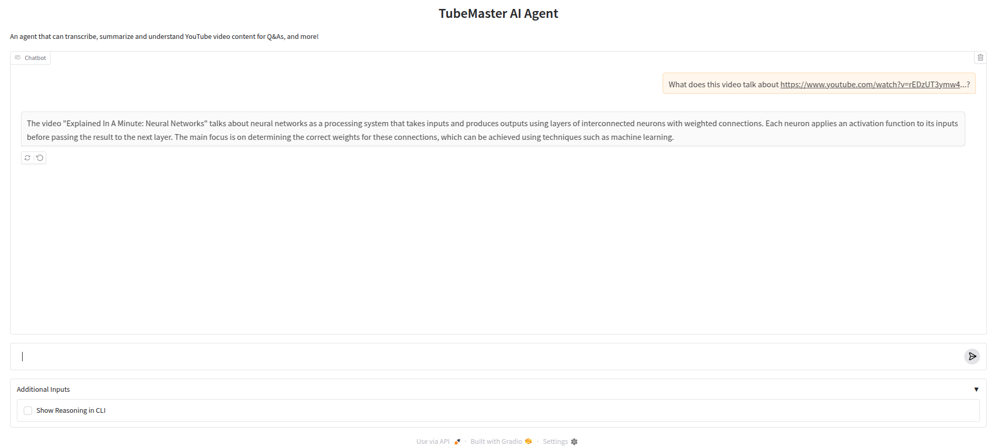

# YouTube Video Transcription/Summarization Agent
A simple project on AI agents with LlamaIndex and HuggingFace's inference API's. The [Youtube-Master-Agent](./agents/tubemaster.py) can transcribe youtube videos (provided with a video link), generate summaries and answer questions on the content of those videos.

## Agent Tools
- **Transcription tool**: This [tool](./tools/transcriber.py) transcribes YouTube videos into text using Hugging Face's inference API (using the Whisper Model).
- **Youtube2mp3 tool**: This [tool](./tools/youtube_fetcher.py) will fetch the audio as an mp3 file from Youtube for your agent.
- **Response formatting tool**: This [tool](./tools/response_formatter.py) is just used to format the response of the agent in a more readable format.

## Getting Started
To test the agent you can either follow the [Notebook Guide](agent.ipynb) or run the [CLI script](agent_cli.py) for an interactive chat-mode as for example:
```
python agent_cli.py --show-reasoning
```

When using the `--show-reasoning` modem you will be able to see the detailed reasoning steps of the agent in your terminal. Additional options are:
- `--respond-json`: When this flag is set the agent will always respond to a video summary request with a JSON-formatted string:
```
{
    "Youtube Videos": [
        "title": ...,
        "url": ...,
        "topic": ....,
        "summary": ....
    ]
}
```

## Testing the agent with an interactive UI build with Gradio
You can also use the agent with a simple UI build with Gradio, by running the [Agent UI](./agent_gradio.py) script locally:
```
python agent_gradio.py
```


### Prerequisites
To use this project you need a Hugging Face API key. Once you have it export it as an env variable:
```
export HF_API_KEY=<YOUR_KEY>
```
Then install requirements:
```
pip install -r requirements.txt
```
